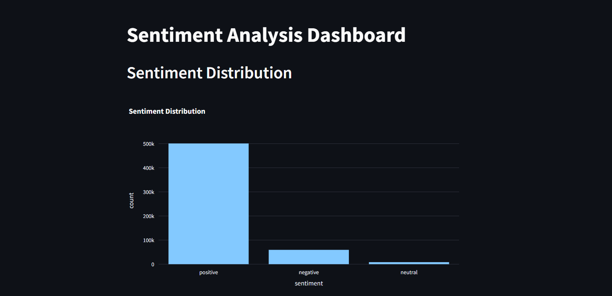
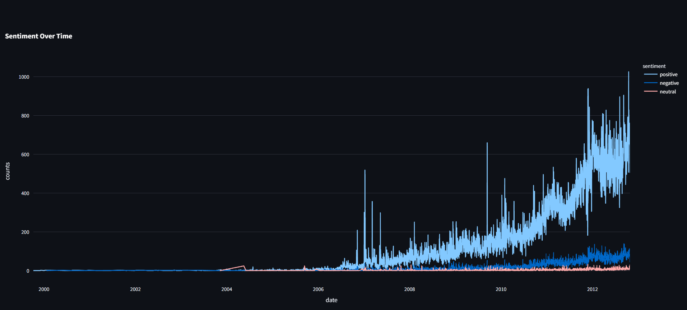

# Sentiment Analysis Dashboard

This project is a web-based dashboard that visualizes the sentiment of customer reviews. It performs sentiment analysis on the review text and presents the results through interactive graphs, allowing users to understand trends in customer feedback.

## Features

-   **Data Preprocessing**: Cleans and preprocesses raw text data for analysis.
-   **Sentiment Analysis**: Analyzes the sentiment of each review (positive, neutral, negative) using TextBlob.
-   **Interactive Dashboard**: A Streamlit-based dashboard to visualize sentiment data.
-   **Visualizations**:
    -   A bar chart showing the overall distribution of sentiments.
    -   A line chart displaying the trend of sentiments over time.

## Dashboard Preview

Here are some screenshots of the dashboard in action.

### Sentiment Distribution

This chart shows the total number of reviews for each sentiment category.



### Sentiment Over Time

This chart shows how the volume of positive, neutral, and negative reviews has changed over time.



## Technologies Used

-   **Python**: The core programming language for the project.
-   **pandas**: For data manipulation and analysis.
-   **NLTK & TextBlob**: For natural language processing and sentiment analysis.
-   **Streamlit**: To create and run the interactive web dashboard.
-   **Plotly**: For creating interactive and dynamic visualizations.
-   **Matplotlib & Seaborn**: For static data visualization.

## Project Structure

```
sentiment_analysis_dashboard/
├── data/
│   └── Reviews.csv
├── screenshot/
│   ├── sentiment_distribution.png
│   └── sentiment_over_time.png
├── data_preprocessing.py
├── sentiment_analysis.py
├── dashboard.py
├── requirements.txt
└── README.md
```

## Setup and Installation

To get this project up and running on your local machine, follow these steps:

1.  **Clone the repository:**
    ```sh
    git clone https://github.com/aagamCodeCraft/sentiment_analysis_dashboard.git
    cd sentiment_analysis_dashboard
    ```

2.  **Create and activate a virtual environment (recommended):**
    ```sh
    python -m venv venv
    source venv/bin/activate  # On Windows use `venv\Scripts\activate`
    ```

3.  **Install the required dependencies:**
    ```sh
    pip install -r requirements.txt
    ```

## How to Run

1.  **Preprocess the data:**
    This script will clean the raw review data and create `clean_amazon_reviews.csv`.
    ```sh
    python data_preprocessing.py
    ```

2.  **Perform sentiment analysis:**
    This script will analyze the sentiment and create `sentiment_amazon_reviews.csv`.
    ```sh
    python sentiment_analysis.py
    ```

3.  **Run the Streamlit dashboard:**
    This will start the web server and open the dashboard in your browser.
    ```sh
    streamlit run dashboard.py
    ```

## Data

The dataset used for this project is the "Amazon Fine Food Reviews" dataset from Kaggle. You can find more details and download it from [here](https://www.kaggle.com/datasets/snap/amazon-fine-food-reviews). Place the `Reviews.csv` file inside a `data/` directory.

### Additional Resources for Data
- [Kaggle Datasets](https://www.kaggle.com/datasets)
- [UCI Machine Learning Repository](https://archive.ics.uci.edu/ml/datasets.php)
- [Google Dataset Search](https://datasetsearch.research.google.com/)